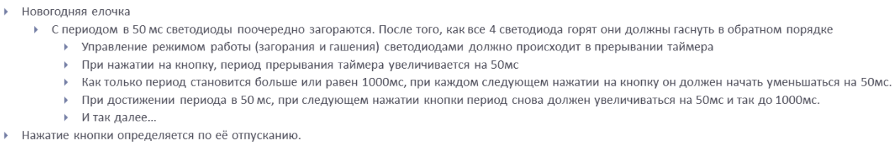
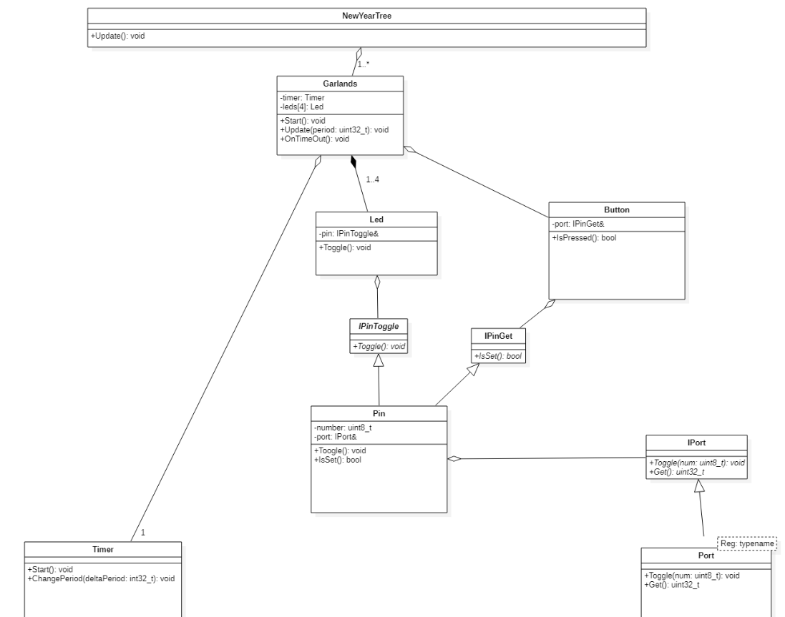
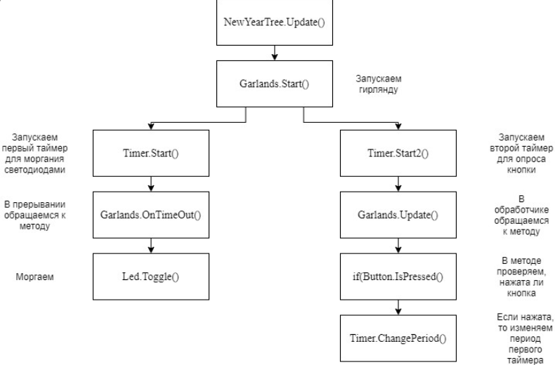
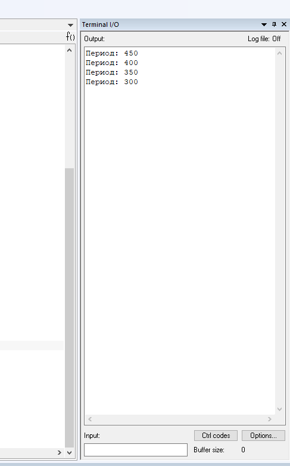

== Работа в IAR Embedded Workbench

=== Работа с классами

Задание:

.Задание

Переписать программу из прошлого задания используя классы.

= *Ход работы:*

*Класс* представляет собой шаблон для создания объектов, обеспечивающий начальные значения состояний:
инициализация полей-переменных и реализация поведения функций или методов.

Является ключевым понятием в *ООП*.

Для успешного выполнения задания потребовалось освоиться в программе *StarUML*. То есть нарисовать примерную архитектуру нашей будущей программы.

.Примерная архитектура

Чтение архитектуры следует начать с *Port*, который является _«typename»_ - это ключевое
слово в языке программирования C ++, используемое при написании шаблонов.
Он используется для указания того,
что зависимое имя в определении или объявлении шаблона является типом.

*Port* общается с *Pin* посредством _интерфейса_ *IPort*, который передает методы *Get()* и *Toggle()*.

*Интерфейс* является программной структурой, определяющей отношение
между объектами, которые разделяют определённое множество и не связаны никак иначе.

Затем, с *Pin*, с помощью интерфейсов мы "общаемся" с *Led* и *Button*, передавая методы *Toggle()*  и *IsSet()*.

Вся наша архитектура "собирается" в "*Garlands.hpp*" и мы получаем всего три метода: *"Start",
"Update" (для таймера)
"OnTimeOut"*.

Дополнительная архитектура представлена ниже:

.Дополнительно

Самый верхний класс в архитектуре - *NewYearTree*, который имеет всего один метод, но при этом включает в себя
целый ряд других методов из разных классов.

Отличительной особенностью программы является вывод значения периода в терминал:

.Терминал

Далее представлены коды программы всех классов:

----
port.hpp

#include <cstdint> //äëÿ ñòä32, ñòä8
#include <cassert>
#pragma once

class IPort
{
  public:
    virtual void Toggle(std::uint8_t num) = 0;
    virtual std::uint32_t Get() = 0;
};

template <typename Reg>
class Port:  public IPort
{
  public:
    void Toggle(std::uint8_t num) override
    {
      assert(num < 16);
      Reg::ODR::Toggle(1 << num);
    }
    std::uint32_t Get() override
    {
      return Reg::IDR::Get();
    }
};
----

----
pin.hpp

#pragma once
#include "port.hpp"

class IPinToggle
{
  public:
    virtual void Toggle() = 0;
};
class IPinGet
{
  public:
      virtual bool IsSet() = 0;
};
class Pin: public IPinToggle, public IPinGet
{
public:
  Pin(std::uint8_t num, IPort& aPort): number(num),  port(aPort)
    {
    }
  void Toggle() override
  {
    port.Toggle(number);
  }
  bool IsSet() override
  {
    return ((port.Get() & (1 << number)) != 0U);
  }
private:
  std::uint8_t number;
  IPort& port;
};
----

----
led.hpp
#pragma once
#include "pin.hpp"

class Led
{
  public:
    Led(IPinToggle& aPin): pin(aPin)
    {

    }
    void Toggle()
    {
      pin.Toggle();
    }
  private:
     IPinToggle& pin;

};
----

----
button.hpp

#pragma once
#include "pin.hpp"

class Button
{
  public:
    Button(IPinGet& aButton): pin(aButton)
    {
    }
    bool IsPressed()
    {
      return (!pin.IsSet());
    }
  private:
     IPinGet& pin;
};

----

----
timer.hpp

#pragma once
#include "nvicregisters.hpp"
#include "tim5registers.hpp"
#include "gpiocregisters.hpp"
#include "gpioaregisters.hpp"
#include "rccregisters.hpp"
#include "tim2registers.hpp"

class Timer
{
  public:

    void Start(std::uint32_t Period)
    {
      RCC::APB1ENR::TIM5EN::Enable::Set();
      TIM5::PSC::Write(7999U);
      TIM5::ARR::Write(Period);
      TIM5::CNT::Write(0U);
      NVIC::ISER1::Write(1U << 18U);
      TIM5::DIER::UIE::Value1::Set();
      TIM5::SR::UIF::NoInterruptPending::Set();
      TIM5::CR1::CEN::Enable::Set();
    }
    void ChangePeriod(uint32_t UpdatePeriod)
    {
      TIM5::ARR::Write(UpdatePeriod);
      TIM5::CNT::Write(0U);
    }
    void Start2()
    {
      NVIC::ISER0::Write(1U << 28U);
      TIM2::CR1::URS::OverflowEvent::Set();
      RCC::APB1ENR::TIM2EN::Enable::Set();
      TIM2::PSC::Set(7999U);
      TIM2::ARR::Write(100U);
      TIM2::SR::UIF::NoInterruptPending::Set();
      TIM2::CNT::Write(0U);
      TIM2::DIER::UIE::Enable::Set();
      TIM2::CR1::CEN::Enable::Set();
    }
private:
  uint32_t Period;

};
----

----
garlands.hpp

#pragma once
#include <cstdint>
#include <cassert>
#include "led.hpp"
#include "button.hpp"
#include <array>
#include "pinscfg.h"
#include "timer.hpp"
#include <iostream>

extern Timer timer;
class Garlands
{
  public:
    Garlands(Button& aButton): button(aButton),  leds{
                                                     Led(led1Pin),
                                                     Led(led2Pin),
                                                     Led(led3Pin),
                                                     Led(led4Pin)
                                                     }
    {

    }

     void Start()
    {
      timer.Start(Period);
      timer.Start2();
    }

    void Update()
    {
        if(button.IsPressed())
        {
        uint32_t CurrentPeriod = TIM5::ARR::Get();

        if(flag == 0)
        {
          UpdatePeriod = CurrentPeriod - 50U;
          if(UpdatePeriod == 50U)
          {
            flag = 1;
          }
        }

        else
        {
          UpdatePeriod = CurrentPeriod + 50U;
          if(UpdatePeriod == 500U)
          {
            flag = 0;
          }
        }

        timer.ChangePeriod(UpdatePeriod);
        std::cout <<"Ïåðèîä: " <<  UpdatePeriod << std::endl;
        }

    }

    void OnTimeOut()
    {
      leds[i++ & 0x3].Toggle();
    }

private:
   std::array<Led, 4> leds;
   Button& button;
   bool flag = 0;
   int i = 0;
   uint32_t Period = 500U;
   uint32_t UpdatePeriod;
};
----

----
pinscfg.h

#pragma once
#include "port.hpp"
#include "pin.hpp"
#include "gpiocregisters.hpp"
#include "gpioaregisters.hpp"
#include "led.hpp"

inline Port<GPIOC> PortC;
inline Port<GPIOA> PortA;
inline Pin led1Pin(5, PortC);
inline Pin led2Pin(8, PortC);
inline Pin led3Pin(9, PortC);
inline Pin led4Pin(5, PortA);
----

----
newYearTree.hpp

#pragma once
#include "garlands.hpp"

extern Garlands garlands;

class NewYearTree
{
  public:
    void Update()
    {
        garlands.Start();
    }
};
----

----
main.cpp

#include "port.hpp"
#include "pin.hpp"
#include "gpiocregisters.hpp"
#include "gpioaregisters.hpp"
#include "rccregisters.hpp"
#include <cstdint>
#include <iostream>
#include "led.hpp"
#include "button.hpp"
#include "garlands.hpp"
#include "nvicregisters.hpp"
#include "newYearTree.hpp"

extern "C"
{
  int __low_level_init(void)
  {
    RCC::CR::HSEON::On::Set();
    while (!RCC::CR::HSERDY::Ready::IsSet())
    {
    }
    RCC::CFGR::SW::Hse::Set();
    while (!RCC::CFGR::SWS::Hse::IsSet())
    {
    }
    RCC::CR::HSION::Off::Set();
    RCC::AHB1ENR::GPIOCEN::Enable::Set();
    RCC::AHB1ENR::GPIOAEN::Enable::Set();
    GPIOC::MODER::MODER5::Output::Set();
    GPIOA::MODER::MODER5::Output::Set();
    GPIOC::MODER::MODER9::Output::Set();
    GPIOC::MODER::MODER8::Output::Set();
    GPIOC::MODER::MODER13::Input::Set();

    return 1;
  }
Pin buttonPin(13, PortC);
Button button(buttonPin);
Timer timer;
Garlands garlands(button);
NewYearTree newYearTree;

int main()
{
  newYearTree.Update();
  for(;;)
  {
  }
  return 0;
}

----

----
Файл startup.cpp

#pragma language = extended
#pragma segment = "CSTACK"
#include "garlands.hpp"
#include "tim5registers.hpp"
#include "tim2registers.hpp"

extern "C" void __iar_program_start( void );

extern Garlands garlands;
class TIM5Int
{
  public:
    static void handler()
    {
       garlands.OnTimeOut();
       TIM5::SR::UIF::NoInterruptPending::Set();
    }
};
class TIM2Int
{
  public:
    static void handler()
    {
       garlands.Update();
       TIM2::SR::UIF::NoInterruptPending::Set();
    }
};

class DummyModule
{
  public:
    static void handler();
};

using tIntFunct = void(*)();
//cstat !MISRAC++2008-9-5-1
using tIntVectItem = union {tIntFunct __fun; void * __ptr;};

// The vector table is normally located at address 0.
// When debugging in RAM, it can be located in RAM, aligned to at least 2^6.
// If you need to define interrupt service routines,
// make a copy of this file and include it in your project.
// The name "__vector_table" has special meaning for C-SPY:
// it is where the SP start value is found, and the NVIC vector
// table register (VTOR) is initialized to this address if != 0.

#pragma location = ".intvec"
//cstat !MISRAC++2008-0-1-4_b !MISRAC++2008-9-5-1
extern "C" const tIntVectItem __vector_table[] =
{
  { .__ptr = __sfe( "CSTACK" ) },
  __iar_program_start,

  DummyModule::handler,
  DummyModule::handler,
  DummyModule::handler,
  DummyModule::handler,
  DummyModule::handler,
  0,
  0,
  0,
  0,
  DummyModule::handler,
  DummyModule::handler,
  0,
  DummyModule::handler,
  DummyModule::handler,
  //External Interrupts
  DummyModule::handler,         //Window Watchdog
  DummyModule::handler,         //PVD through EXTI Line detect/EXTI16
  DummyModule::handler,         //Tamper and Time Stamp/EXTI21
  DummyModule::handler,         //RTC Wakeup/EXTI22
  DummyModule::handler,         //FLASH
  DummyModule::handler,         //RCC
  DummyModule::handler,         //EXTI Line 0
  DummyModule::handler,         //EXTI Line 1
  DummyModule::handler,         //EXTI Line 2
  DummyModule::handler,         //EXTI Line 3
  DummyModule::handler,         //EXTI Line 4
  DummyModule::handler,         //DMA1 Stream 0
  DummyModule::handler,         //DMA1 Stream 1
  DummyModule::handler,         //DMA1 Stream 2
  DummyModule::handler,         //DMA1 Stream 3
  DummyModule::handler,         //DMA1 Stream 4
  DummyModule::handler,         //DMA1 Stream 5
  DummyModule::handler,         //DMA1 Stream 6
  DummyModule::handler,         //ADC1
  0,                            //USB High Priority
  0,                            //USB Low  Priority
  0,                            //DAC
  0,                            //COMP through EXTI Line
  DummyModule::handler,         //EXTI Line 9..5
  DummyModule::handler,         //TIM9/TIM1 Break interrupt
  DummyModule::handler,         //TIM10/TIM1 Update interrupt
  DummyModule::handler,         //TIM11/TIM1 Trigger/Commutation interrupts
  TIM2Int::handler,		//TIM1 Capture Compare interrupt
  TIM2Int::handler,         //TIM2
  DummyModule::handler,         //TIM3
  DummyModule::handler,         //TIM4
  DummyModule::handler,         //I2C1 Event
  DummyModule::handler,         //I2C1 Error
  DummyModule::handler,         //I2C2 Event
  DummyModule::handler,         //I2C2 Error
  DummyModule::handler,         //SPI1
  DummyModule::handler,         //SPI2
  DummyModule::handler,         //USART1
  DummyModule::handler,         //USART2
  0,
  DummyModule::handler,         //EXTI Line 15..10
  DummyModule::handler,         //EXTI Line 17 interrupt / RTC Alarms (A and B) through EXTI line interrupt
  DummyModule::handler,         //EXTI Line 18 interrupt / USB On-The-Go  FS Wakeup through EXTI line interrupt
  0,				//TIM6
  0,				//TIM7  f0
  0,
  0,
  DummyModule::handler,         //DMA1 Stream 7 global interrupt fc
  DummyModule::handler,
  DummyModule::handler,	        //SDIO global interrupt
  TIM5Int::handler,	        //TIM5 global interrupt
  DummyModule::handler,	        //SPI3 global interrupt
  0,			        // 110
  0,
  0,
  0,
  DummyModule::handler,		//DMA2 Stream0 global interrupt 120
  DummyModule::handler,		//DMA2 Stream1 global interrupt
  DummyModule::handler,		//DMA2 Stream2 global interrupt
  DummyModule::handler,		//DMA2 Stream3 global interrupt
  DummyModule::handler,		//DMA2 Stream4 global interrupt 130
  0,
  0,
  0,
  0,
  0,
  0,
  DummyModule::handler,		//USB On The Go FS global interrupt, 14C
  DummyModule::handler,		//DMA2 Stream5 global interrupt
  DummyModule::handler,		//DMA2 Stream6 global interrupt
  DummyModule::handler,		//DMA2 Stream7 global interrupt
  DummyModule::handler,				//USART6 15C
  DummyModule::handler,         //I2C3 Event
  DummyModule::handler,         //I2C3 Error 164
  0,
  0,
  0,
  0,
  0,
  0,
  0,
  DummyModule::handler,		//FPU 184
  0,
  0,
  DummyModule::handler,		//SPI 4 global interrupt
  DummyModule::handler		//SPI 5 global interrupt
};

void DummyModule::handler()   { for(;;) {} } ;

extern "C" void __cmain( void );
extern "C" __weak void __iar_init_core( void );
extern "C" __weak void __iar_init_vfp( void );

#pragma required=__vector_table
void __iar_program_start( void )
{
  __iar_init_core();
  __iar_init_vfp();
  __cmain();
}

----

